# Spring Cloud Stream - Kafka Streams

## Docker 
###  le fichier docker-compose.yml
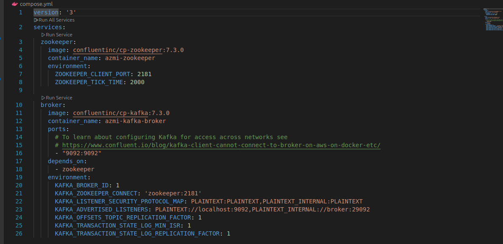
### Démarrer les conteneurs docker : zookeeper et kafka-broker
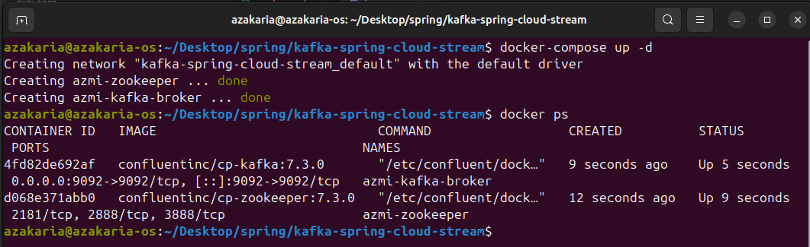

### Tester avec Kafka-console-producer et kafka-console-consumer
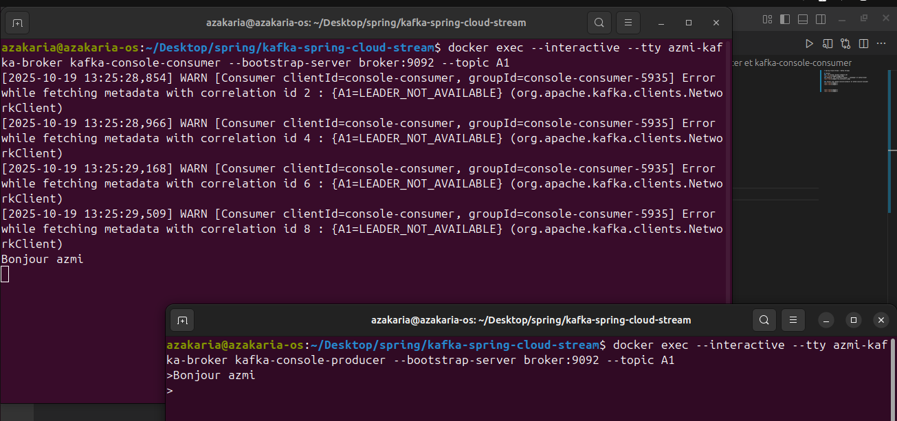

## KAFKA et Stpring Cloud Streams

### Service Producer KAFKA via RestController
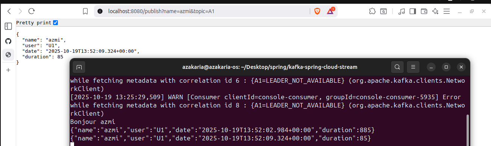

### Service Consumer KAFKA
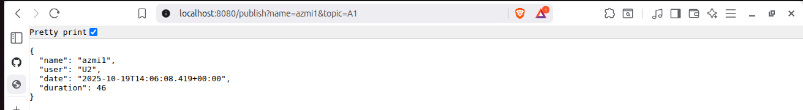
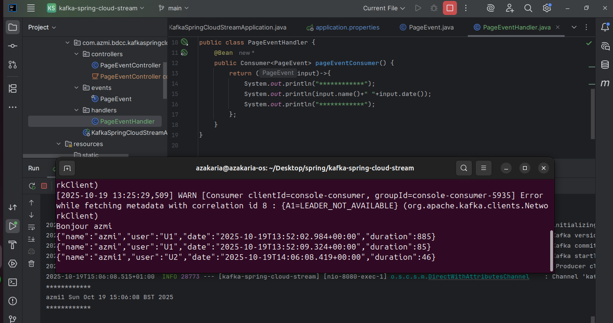

### Service Supplier KAFKA
#### Properties ( avec un delay to 5s )
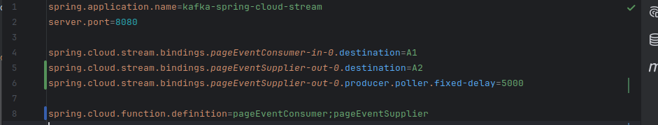
#### Resultat dans consumer A2
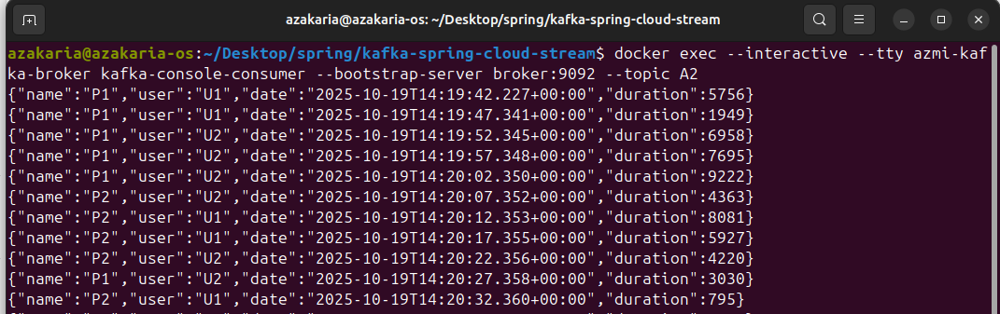

### Service Data Analytics Real Time Stream Processing KAFKA
#### Fonction KStream
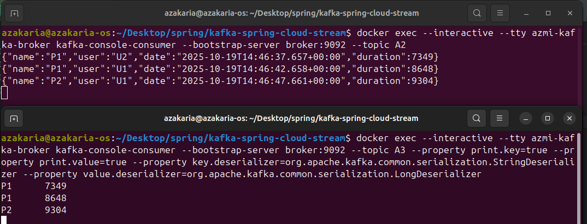
#### Analytics endpoint
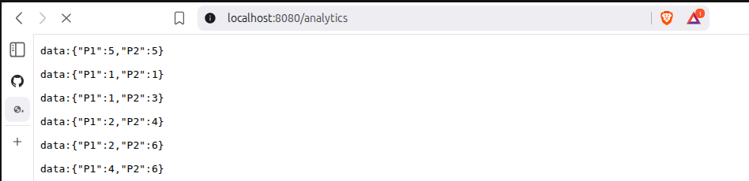

#### Page index 
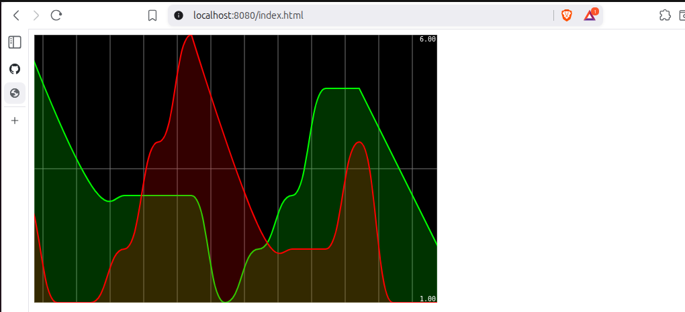

